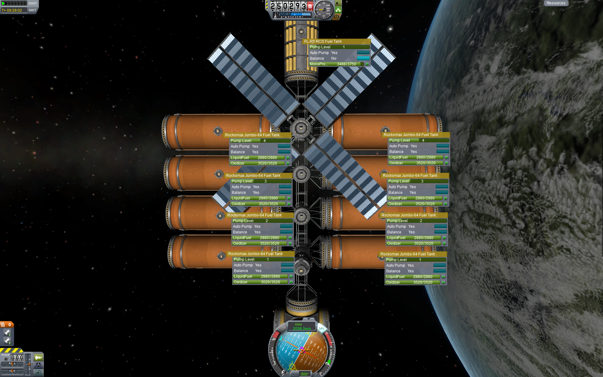
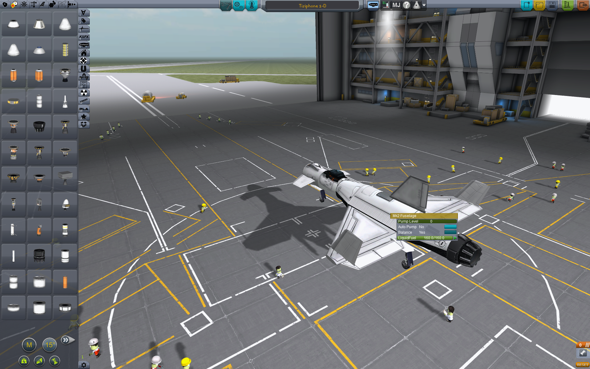
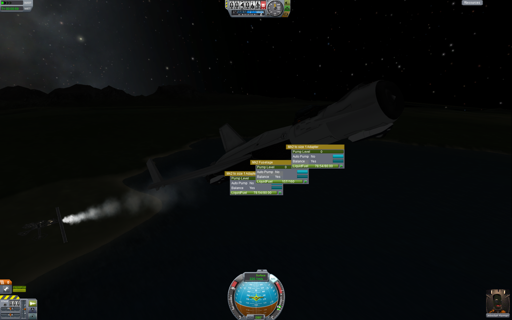
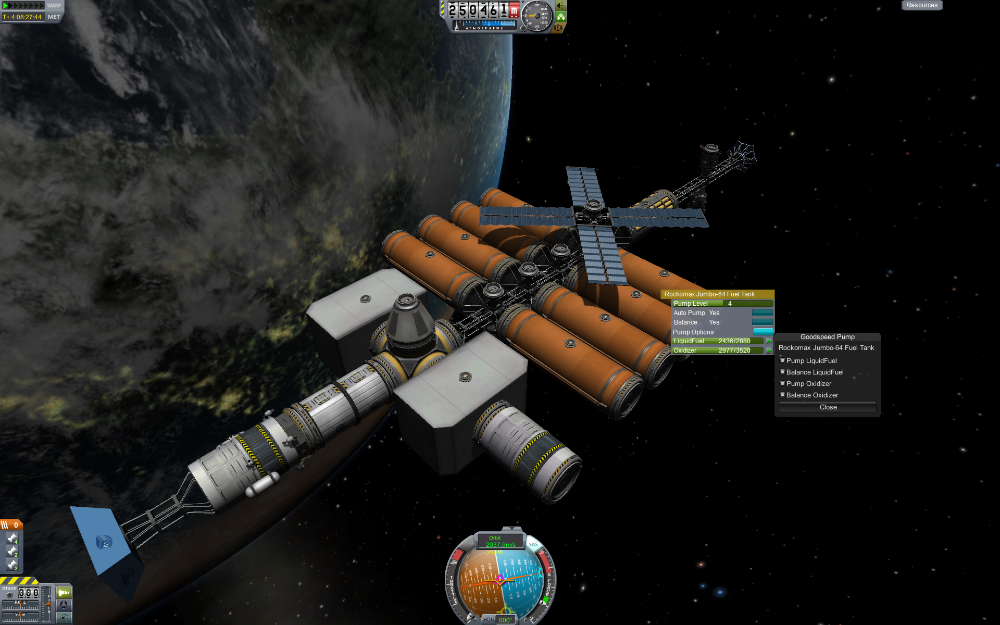

<!-- Marketing.md v1.0.0.0
Goo Pumps & Oils' Speed Pump (GPO)
created: 13 Apr 2022
updated: 
-->

# Goo Pumps & Oils' Speed Pump (GPO)

[Home](./index.html)

## 1

Tanks at higher levels empty first, tanks with the same level maintain left/right balance

[top](#GPO Speed Pump )

---

## 2

This is just demonstrating that the pump options can be set in the VAB or SPH and saved with the craft.

[top](#GPO Speed Pump )

---

## 3

Just showing tanks maintaining balance in-flight.

[top](#GPO Speed Pump )

---

## 4

The Forge orbital construction space station, here demoing the Pump Options window on one of its tanks

[top](#GPO Speed Pump )

---
